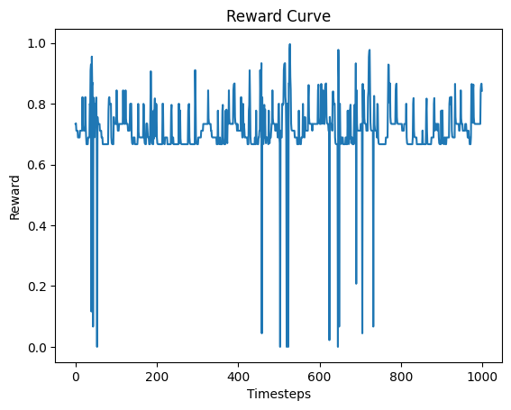

# Reinforcement Learning for Self-Driving Cars (PPO)

This project trains an autonomous driving agent using Reinforcement Learning in the `highway-v0` environment.

The agent learns to navigate traffic safely using Proximal Policy Optimization (PPO).

## Environment

Gymnasium highway-v0

Simulated multi-lane highway environment where an agent must:
- Avoid collisions
- Maintain safe driving
- Navigate traffic efficiently

## Algorithm

Proximal Policy Optimization (PPO)

Training implemented using Stable-Baselines3 with an MLP policy.

## Training Setup

Algorithm: PPO  
Environment: highway-v0  
Library: Stable-Baselines3  
Training Steps: 10,000  
Device: CPU  

## Performance Metrics

Mean Episode Reward: 20.7  
Mean Episode Length: 28.7  
Crashes during evaluation: 0  

The agent gradually learned collision avoidance after ~5000 training steps. :contentReference[oaicite:0]{index=0}

## Reward Curve

## Simulation Video

results/highway_eval (1).mp4

## Project Structure

notebooks/ppo_self_driving_car.ipynb – training notebook  
results/ – reward curves and evaluation videos  
report/ – detailed project report  

## Tech Stack

Python  
Stable-Baselines3  
Gymnasium  
PyTorch  

## Author

Ganesh Sonawane  
B.Tech Energy Science and Engineering  
IIT Bombay
